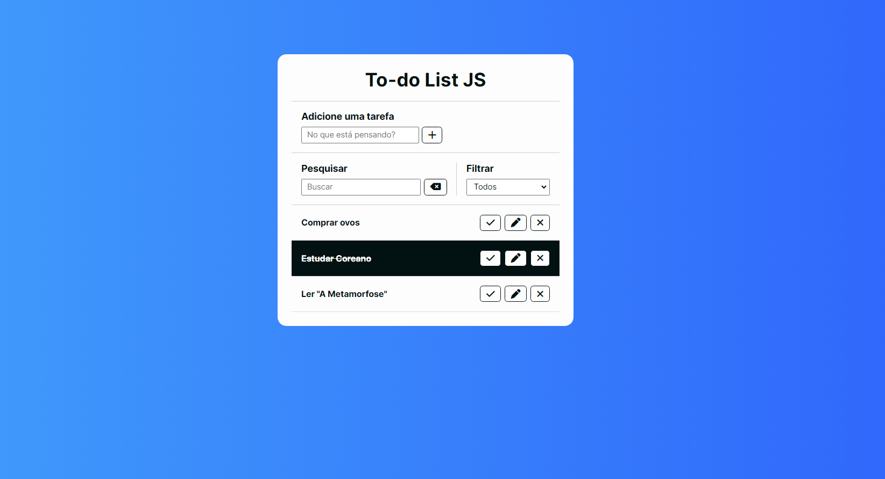

# To-do List JS
Um projeto web baseado em HTML, CSS e JavaScript de uma Lista de Tarefas, onde o usuário pode adicionar diversas tarefas, marcá-las como feitas, editá-las e removê-las, bem como buscar por uma tarefa e filtrar sua lista. 

A persistência dos dados é feita através do Local Storage, uma API padrão oferecida pelo navegador semelahnte aos cookies.

