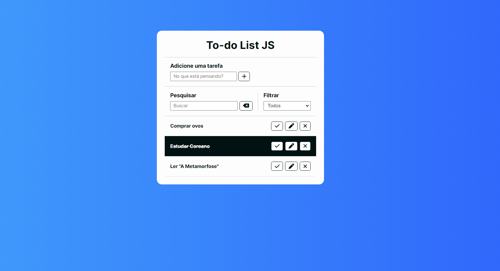

# To-do List JS

Um projeto web baseado em HTML, CSS e JavaScript de uma Lista de Tarefas, onde o usuário pode adicionar diversas tarefas, marcá-las como feitas, editá-las e removê-las, bem como buscar e filtrar suas atividades do dia.

A persistência de dados é feita através do Local Storage, uma API padrão fornecida pelo navegador, semelhante aos cookies, para o armazenamento das informações para futuras sessões.

🌎 A web project based on HTML, CSS and JavaScript for a To-do List, where the user can add different tasks, mark them as done, edit and remove them, as well as search and filter their activities for the day.

Data persistence is done through Local Storage, a standard API provided by the browser, similar to cookies, for storing information for future sessions.

